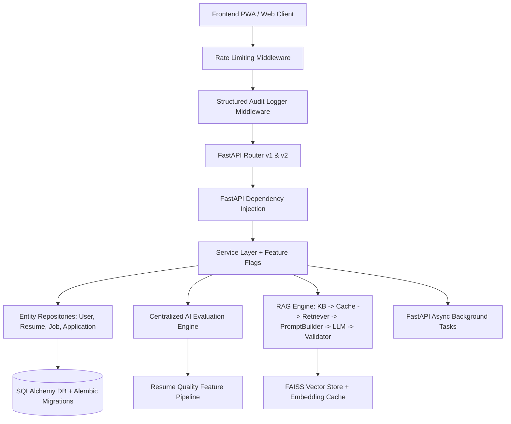
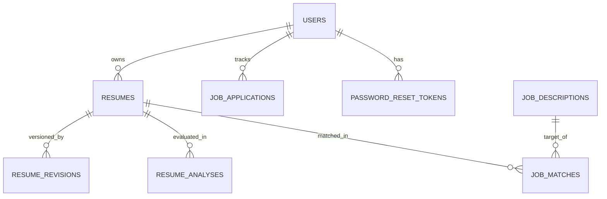

# Architecture & System Design Document — HireMind AI

## System Overview

HireMind AI is an enterprise-grade Career Intelligence Operating System designed with clean software engineering principles, modular service layers, repository isolation, FAISS vector search, and unified AI evaluation.

---

## Architectural Layering

### 1. API Layer (`app/api/`)
- Handles HTTP requests, payload validation via Pydantic schemas, and response formatting.
- Enforces strict security headers, CORS origins, and OpenAPI example documentation.

### 2. Dependency Injection & Middleware (`app/core/`)
- `get_db`: Grants clean database session scopes per request.
- `SecurityHeadersMiddleware`: Injects `X-Content-Type-Options`, `X-Frame-Options`, `Referrer-Policy`, and `CSP`.
- `RateLimiter`: Sliding-window rate limiting protecting sensitive auth and AI endpoints.
- `FeatureFlags`: Config-driven feature switches (`ENABLE_EXPERIMENTAL_AI`, `ENABLE_FAISS_VECTOR_SEARCH`).

### 3. Service Layer & AI Engines (`app/services/`)
- **Centralized AI Evaluation Engine** (`evaluation_engine.py`): Single source of truth for ATS scoring, resume quality evaluation, job matching, and roadmap generation.
- **Resume Quality Feature Pipeline** (`resume_quality_pipeline.py`): Feature engineering pipeline computing Readability, Action Verbs Density, Bullet Structure, Quantified Achievements Ratio, and Formatting Completeness.
- **FAISS Vector RAG Engine** (`career_coach.py` & `vector_store.py`):
  `Knowledge Base` $\rightarrow$ `Embedding Cache` $\rightarrow$ `FAISS Retriever` $\rightarrow$ `Prompt Builder` $\rightarrow$ `LLM` $\rightarrow$ `Answer Validator`.

### 4. Repository Pattern (`app/repositories/`)
- Isolates raw database interactions from business logic.
- Implements generic CRUD operations via `BaseRepository[T]` for:
  - `UserRepository`
  - `ResumeRepository`
  - `JobRepository`
  - `ApplicationRepository`

### 5. Database & Migrations (`app/database/` & `alembic/`)
- SQLAlchemy ORM with SQLite (development) and PostgreSQL (production).
- Alembic database migration scripts with SQLite batch mode support (`render_as_batch=True`).

---

## Database Entity-Relationship Diagram (ERD)

---

## Observability & Prometheus Metrics

Exposed metrics at `/metrics`:
- `hiremind_api_requests_total`: Counter tracking API requests.
- `hiremind_ats_evaluations_total`: Counter tracking ATS scoring executions.
- `hiremind_faiss_vectors_indexed`: Gauge of indexed knowledge base vectors.
