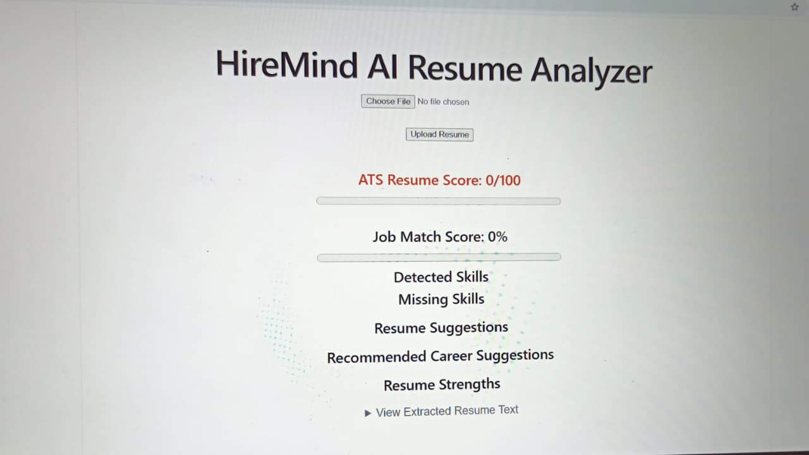
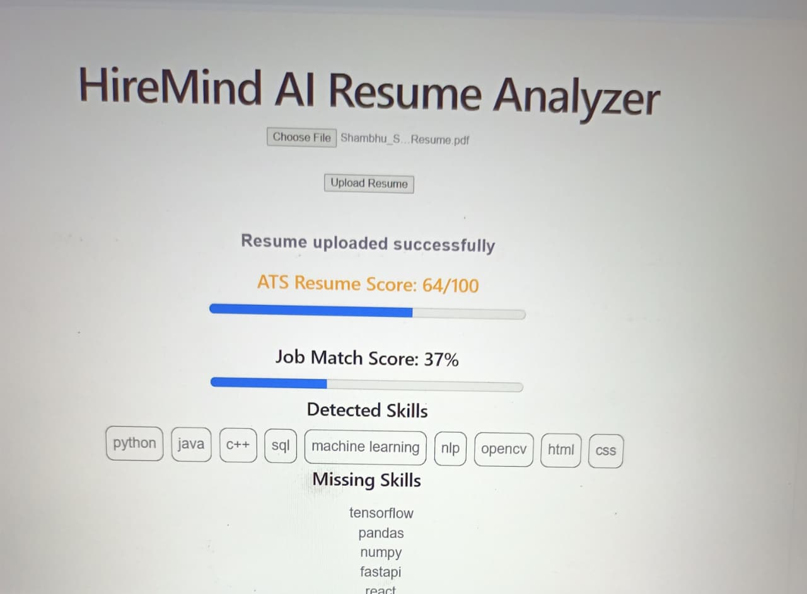
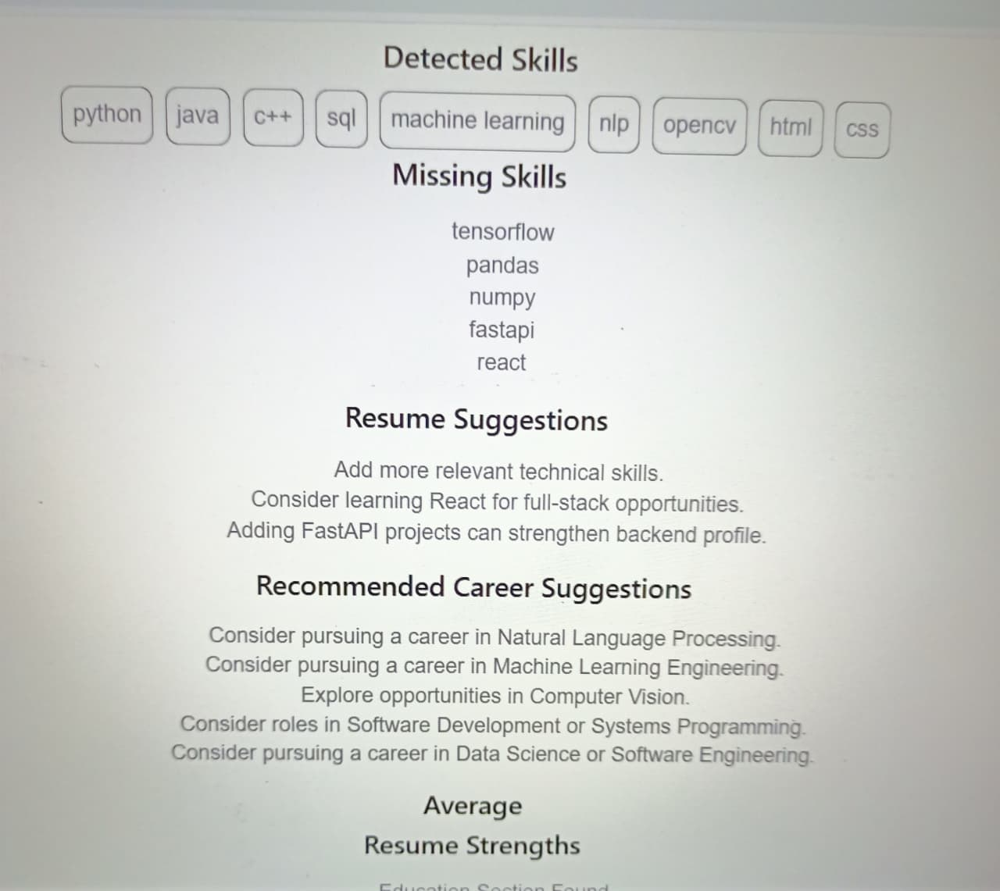
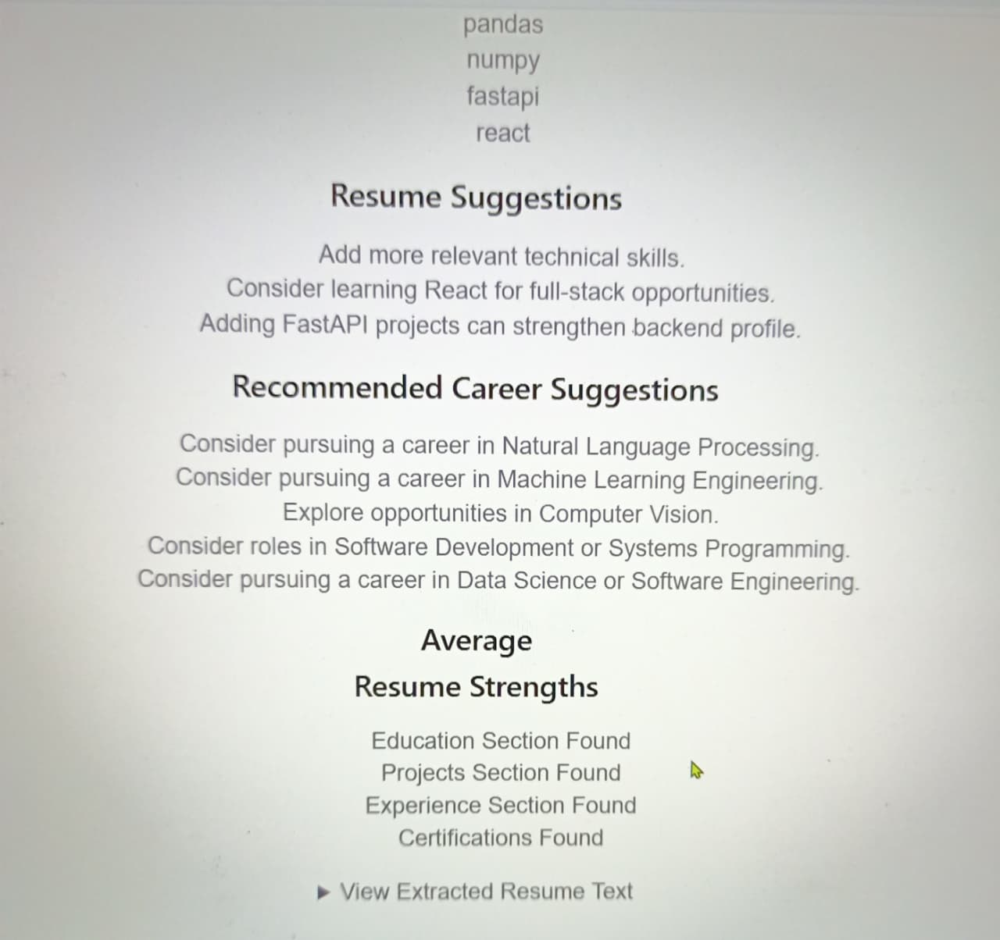
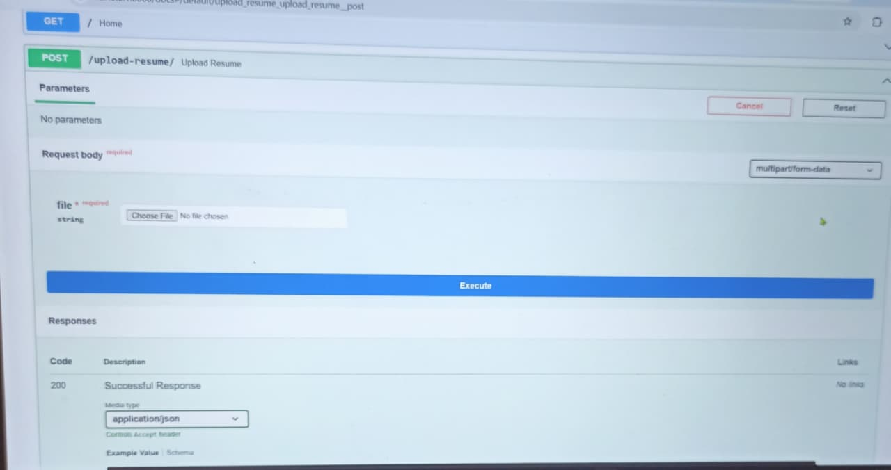

  

<h1 align="center">🧠 HireMind AI</h1>

<strong>AI-Powered Resume Analyzer & Career Intelligence Platform</strong>

  
  
  
  
  

---

Analyze resumes, calculate ATS scores, identify missing skills, evaluate job compatibility, and generate personalized career recommendations using Artificial Intelligence.

## 🚀 Features

- **PDF Resume Upload** – Seamless automatic text extraction.
- **ATS Score Calculation** – Comprehensive resume evaluation.
- **Skill Detection** – Advanced NLP-based keyword extraction.
- **Missing Skills Analysis** – Compare against real-world industry standards.
- **Job Match Score** – Direct calculation of candidate-to-job alignment.
- **Career Recommendations** – Machine Learning-driven career pathing.
- **Resume Strength Analysis** – Core structural section validation.
- **Modern Tech Stack** – FastAPI backend coupled with a fast React frontend.

---

📌 Overview

HireMind AI is an intelligent resume analysis platform designed to help students, job seekers, and professionals optimize their resumes for modern recruitment systems.

The system automatically extracts information from uploaded resumes, analyzes technical skills, calculates ATS compatibility scores, identifies missing j ob-relevant skills, and provides career guidance.

---

🎯 Project Objective

The primary objective of HireMind AI is to bridge the gap between job seekers and industry requirements by:

- Improving ATS compatibility
- Identifying missing technical skills
- Evaluating resume quality
- Suggesting career paths
- Providing resume improvement recommendations
- Helping candidates align with industry expectations

---

✨ Key Features

📄 Resume Upload

- Upload Resume in PDF format
- Automatic text extraction
- Resume content analysis

---

🎯 ATS Score Analysis

The system calculates an ATS (Applicant Tracking System) score based on:

- Technical skills
- Projects
- Certifications
- Experience
- Resume content quality
- Education details

Example:

ATS Score: 76/100

---

🧠 Skill Extraction

Automatically detects skills such as:

- Python
- Java
- SQL
- TensorFlow
- Pandas
- NumPy
- NLP
- OpenCV
- PyTorch
- Keras
- Machine Learning
- Deep Learning

and many more.

---

📉 Missing Skills Detection

Compares resume skills with industry requirements.

Example:

Missing Skills:
- FastAPI
- React

---

💼 Job Match Score

Measures how well a candidate matches industry-required skills.

Example:

Job Match Score: 75%

---

💡 Resume Suggestions

Provides personalized recommendations such as:

- Add more technical skills
- Improve project descriptions
- Add internship experience
- Learn relevant technologies

---

🎓 Career Recommendations

Generates suitable career paths based on detected skills.

Examples:

- AI Engineer
- Machine Learning Engineer
- Data Scientist
- NLP Engineer
- Computer Vision Engineer
- Data Analyst
- Software Developer

---

📊 Resume Strength Analysis

Checks important sections including:

- Education
- Projects
- Experience
- Certifications

Example:

✓ Education Section Found
✓ Projects Section Found
✓ Experience Section Found
✓ Certifications Found

---

🏗️ System Architecture

User Uploads Resume
          │
          ▼
PDF Extraction Engine
          │
          ▼
Resume Text Processing
          │
          ▼
Skill Detection Module
          │
          ▼
ATS Score Calculation
          │
          ▼
Job Match Analysis
          │
          ▼
Career Recommendation Engine
          │
          ▼
Results Displayed on Frontend

---

🛠️ Technologies Used

Backend

- Python
- FastAPI
- spaCy
- PyPDF
- Uvicorn

Frontend

- React.js
- Vite
- JavaScript
- HTML
- CSS

NLP

- spaCy NLP Engine
- Keyword-based Skill Extraction

Development Tools

- VS Code
- Git
- GitHub
- Postman
- Swagger UI

---

📂 Project Structure

HireMind-AI/
│
├── backend/
│   ├── main.py
│   ├── requirements.txt
│   ├── download_model.py
│
├── frontend/
│   ├── src/
│   │   ├── App.jsx
│   │   ├── App.css
│   │   ├── main.jsx
│   │
│   ├── package.json
│   └── vite.config.js
│── README.md
└── screenshots/
    ├── homepage.png
    ├── analysis.png
    ├── skills.png
    ├── career.png
    └── api-docs.png

---

⚙️ Installation

Clone Repository

git clone https://github.com/shambhushekharsinha-engg/HireMind-AI.git

cd HireMind-AI

---

Backend Setup

cd backend

pip install -r requirements.txt

python download_model.py

uvicorn main:app --reload

Backend:

http://localhost:8000

Swagger API Docs:

http://localhost:8000/docs

---

Frontend Setup

cd frontend

npm install

npm run dev

Frontend:

http://localhost:5173

---

📈 Current Capabilities

✅ Resume Upload

✅ PDF Parsing

✅ Skill Extraction

✅ ATS Scoring

✅ Missing Skills Detection

✅ Job Match Analysis

✅ Resume Suggestions

✅ Career Recommendations

✅ Resume Strength Analysis

✅ GitHub Version Control

---

🔮 Future Enhancements

- AI Resume Rewriting
- Resume vs Job Description Comparison
- PDF Report Generation
- Authentication System
- User Dashboard
- Resume History Tracking
- AI Interview Preparation
- LinkedIn Profile Analysis
- Resume Ranking System
- Cloud Deployment

---

# 📸 Screenshots

## Homepage

## Resume Analysis

## Skills Analysis

## Career Recommendations

## API Documentation

---

👨‍💻 Developer

Shambhu Shekhar Sinha

B.Tech Computer Science & Engineering (AI & ML)

Greater Noida Institute of Technology

GitHub: https://github.com/shambhushekharsinha-engg

LinkedIn: https://linkedin.com/in/shambhu-shekhar-sinha-636498341

---

🌟 Project Status

🚧 Project in Active Development

Continuously improving features, UI/UX, and AI capabilities.

---

📜 License

This project is developed for educational, learning, and portfolio purposes.

© 2026 HireMind AI. All Rights Reserved.