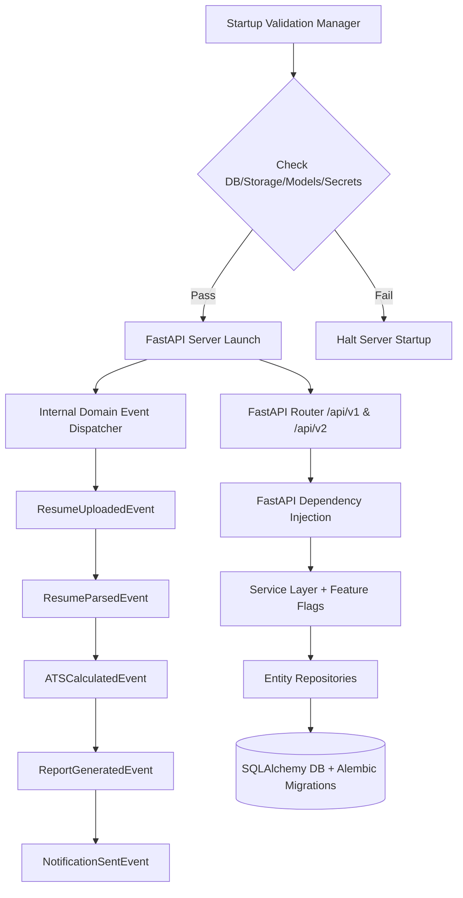
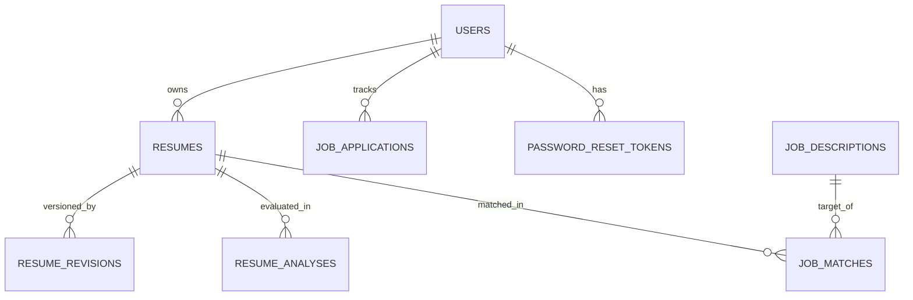

# HireMind AI v3.0 – Enterprise Career Operating System

[](https://github.com/shambhushekharsinha-engg/HireMind-AI/actions)
[](https://fastapi.tiangolo.com)
[](https://react.dev)
[](https://www.docker.com/)
[](https://opensource.org/licenses/MIT)
[](DEVELOPER_PROFILE.md)

> **HireMind AI** is an enterprise-grade **Career Intelligence Operating System** built with clean software engineering principles. It features repository-layer database isolation, a deterministic feature-engineered resume quality pipeline, a FAISS vector store with RAG context retrieval, a lightweight internal domain event dispatcher, structured security and audit logging, Prometheus telemetry, fail-fast startup checks, and complete containerization.

---

## 👨‍💻 Developer Profile & System Architecture Showcase

For a full breakdown of the system architecture, lead engineer bio, software design patterns, and core technical updates, refer to [DEVELOPER_PROFILE.md](DEVELOPER_PROFILE.md).

### Architect Key Highlights
- **Repository-Layer Data Access**: Decoupled database operations into `UserRepository`, `ResumeRepository`, `JobRepository`, and `ApplicationRepository`.
- **Deterministic AI Quality Pipeline**: Feature engineering pipeline scoring Readability, Action Verbs, Bullet Density, Quantified Achievements, and Formatting Completeness.
- **FAISS Vector RAG Engine & Session Memory**: Context-aware Career Coach with turn-by-turn conversation memory.
- **Internal Domain Event Dispatcher**: Publisher-subscriber event bus decoupling system services (`ResumeUploadedEvent` $\rightarrow$ `ResumeParsedEvent` $\rightarrow$ `ATSCalculatedEvent` $\rightarrow$ `ReportGeneratedEvent` $\rightarrow$ `NotificationSentEvent`).
- **Fail-Fast System Startup Validation**: `StartupValidator` inspecting Secret Keys, Storage permissions, Database connectivity, spaCy NLP model, and FAISS Vector Store before accepting traffic.
- **Centralized Error Catalog**: Standardized `HM1000` series error handling (`HM1001` to `HM429`).
- **Comprehensive AI Feature Modules**: 3-Option Selective Bullet Rewriter, Timed Multi-Personality Interview Simulator, Modular Portfolio Analyzer, Adaptive Learning Roadmap, and AI Career Progress Dashboard.
- **46 Automated Tests**: 100% test pass rate across Unit, Integration, API, Security, Performance, and AI Pipeline categories.

---

## 🧪 User Validation & Beta Testing Status

> [!NOTE]
> **Beta Testing Phase**: HireMind AI is currently conducting active beta testing with computer science students and job seekers. User feedback collection and parsing accuracy telemetry are in progress. Actual metrics will be published here upon release candidate completion.

---

## 🌐 Live Production Deployments & Observability

- **⚡ Production Web Application (Vercel)**: [https://hiremind-ai-resume.vercel.app](https://hiremind-ai-resume.vercel.app)
- **⚙️ Backend REST API Documentation (Render)**: [https://hiremind-ai-au7b.onrender.com/docs](https://hiremind-ai-au7b.onrender.com/docs)
- **📊 System Health Check**: [https://hiremind-ai-au7b.onrender.com/health](https://hiremind-ai-au7b.onrender.com/health)
- **🖥️ Operational Health Dashboard**: [https://hiremind-ai-au7b.onrender.com/health/dashboard](https://hiremind-ai-au7b.onrender.com/health/dashboard)
- **📈 Prometheus Telemetry**: [https://hiremind-ai-au7b.onrender.com/metrics](https://hiremind-ai-au7b.onrender.com/metrics)

---

## 🏛️ Enterprise System Architecture


```mermaid
graph TD
    Startup[Startup Validation Manager] --> FailFast{Check DB/Storage/Models/Secrets}
    FailFast -- Pass --> Launch[FastAPI Server Launch]
    FailFast -- Fail --> Stop[Halt Server Startup]

    Launch --> EventBus[Internal Domain Event Dispatcher]
    EventBus --> Event1[ResumeUploadedEvent]
    Event1 --> Event2[ResumeParsedEvent]
    Event2 --> Event3[ATSCalculatedEvent]
    Event3 --> Event4[ReportGeneratedEvent]
    Event4 --> Event5[NotificationSentEvent]
    
    Launch --> Router[FastAPI Router /api/v1 & /api/v2]
    Router --> Dep[FastAPI Dependency Injection]
    Dep --> Service[Service Layer + Feature Flags]
    Service --> Repos[Entity Repositories]
    Repos --> DB[(SQLAlchemy DB + Alembic Migrations)]
```

---

## 🗄️ Database Entity-Relationship Diagram (ERD)


```mermaid
erDiagram
    USERS ||--o{ RESUMES : owns
    USERS ||--o{ JOB_APPLICATIONS : tracks
    USERS ||--o{ PASSWORD_RESET_TOKENS : has
    RESUMES ||--o{ RESUME_REVISIONS : versioned_by
    RESUMES ||--o{ RESUME_ANALYSES : evaluated_in
    RESUMES ||--o{ JOB_MATCHES : matched_in
    JOB_DESCRIPTIONS ||--o{ JOB_MATCHES : target_of
```

---

## 🚀 Key Software Engineering Highlights

1. **Fail-Fast Startup Validation**: `StartupValidator` verifies Database connectivity, Secret keys, Storage permissions, spaCy model loading, and FAISS Vector Store readiness before server initialization.
2. **Domain Event Dispatcher**: Decouples business logic via an in-memory event bus (`ResumeUploadedEvent` $\rightarrow$ `ResumeParsedEvent` $\rightarrow$ `ATSCalculatedEvent` $\rightarrow$ `ReportGeneratedEvent` $\rightarrow$ `NotificationSentEvent`).
3. **Repository Pattern**: Entity repositories (`UserRepository`, `ResumeRepository`, `JobRepository`, `ApplicationRepository`) isolating database transactions from service logic.
4. **Centralized Error Catalog**: Standardized error codes (`HM1000` series) across all HTTP error envelopes.
5. **Deterministic Resume Quality Pipeline**: Feature engineering pipeline scoring Readability, Action Verbs, Bullet Density, Quantified Achievements, and Formatting Completeness.
6. **3-Option Resume Rewriter**: Generates 3 distinct rewrite options (`Professional`, `Executive`, `Metrics-Driven`) per weak bullet point.
7. **Timed Multi-Personality Interview Simulator**: Personality presets (`Strict Tech Lead`, `Supportive HR`, `VP of Engineering`), timer limits (60s/90s), dynamic follow-up questions, and 4D evaluation.
8. **FAISS Vector RAG & Coach Memory**: Context-aware Career Coach with turn-by-turn conversation memory.
9. **Operational Health Dashboard**: Comprehensive status dashboard at `/health/dashboard` inspecting Database, Storage, spaCy, Embedding Cache, Queue, and Vector Store.
10. **Alembic Database Migrations**: Automated migration scripts with SQLite batch mode (`render_as_batch=True`).

---

## 📂 Project Directory Structure

```
HireMind-AI/
├── .github/
│   ├── dependabot.yml           # Automated dependency updates
│   └── workflows/
│       └── ci-cd.yml            # GitHub Actions CI/CD pipeline
├── backend/
│   ├── alembic/                 # Database migration scripts
│   ├── app/
│   │   ├── api/                 # API Routes (v1 & v2)
│   │   ├── core/                # Config, Security, Event Dispatcher, Error Catalog, Startup Check
│   │   ├── database/            # SQLAlchemy Engine & Base
│   │   ├── ml/                  # Feature engineering & NLP models
│   │   ├── models/              # SQLAlchemy Database Models
│   │   ├── repositories/        # Repository Pattern Data Access Layer
│   │   ├── schemas/             # Pydantic Request/Response Schemas
│   │   ├── services/            # Evaluation Engine, RAG, Rewriter, Simulator, Progress Dashboard
│   │   └── tests/               # Pytest Test Suite
│   ├── scripts/
│   │   ├── benchmark_load.py    # Performance & Latency Load Benchmarker
│   │   └── benchmark_history.json # Historical Commit-Tagged Benchmark Telemetry
│   ├── Dockerfile               # Backend Docker Container Definition
│   └── requirements.txt         # Dependencies
├── frontend/
│   ├── public/                  # Manifest, favicon, PWA icons
│   ├── src/                     # React App & Components
│   └── Dockerfile               # Frontend Docker Container Definition
├── .pre-commit-config.yaml      # Formatting & Linting Pre-commit Hooks
├── ARCHITECTURE.md              # In-depth System Architecture Document
├── CHANGELOG.md                 # Release Changelog
├── CONTRIBUTING.md              # Open-Source Contribution Guide
├── DEVELOPER_PROFILE.md         # Developer Profile & Engineering Showcase
├── docker-compose.yml           # Multi-container local orchestration
└── pyproject.toml               # Black, Ruff, and isort Configuration
```

---

## 🔑 Quick Demo Credentials

| Role | Email Login | Mobile No. Login | Password | Access Level |
| :--- | :--- | :--- | :--- | :--- |
| **Student** | `alex.student@hiremind.ai` | `+919876543210` | `demo_pass` | Full Resume, ATS, Job Matcher & Coach |
| **Recruiter** | `recruiter@apextech.com` | `+919876543211` | `demo_pass` | Candidate Ranking & Resume Search |
| **Admin** | `admin@hiremind.ai` | `+919876543212` | `demo_pass` | System Analytics & Metrics Dashboard |

---

## ⚡ Quickstart & Local Installation

```bash
# Clone & Navigate
git clone https://github.com/shambhushekharsinha-engg/HireMind-AI.git
cd HireMind-AI/backend

# Virtual Environment & Install Dependencies
python -m venv venv
source venv/bin/activate  # On Windows: venv\Scripts\activate
pip install -r requirements.txt

# Run Migrations & Start Server
alembic upgrade head
uvicorn app.main:app --reload --port 8000
```

---

## 📄 License & Roadmap

This project is licensed under the [MIT License](LICENSE).
For detailed architecture explanations, refer to [ARCHITECTURE.md](ARCHITECTURE.md), [DEVELOPER_PROFILE.md](DEVELOPER_PROFILE.md), and [CONTRIBUTING.md](CONTRIBUTING.md).
