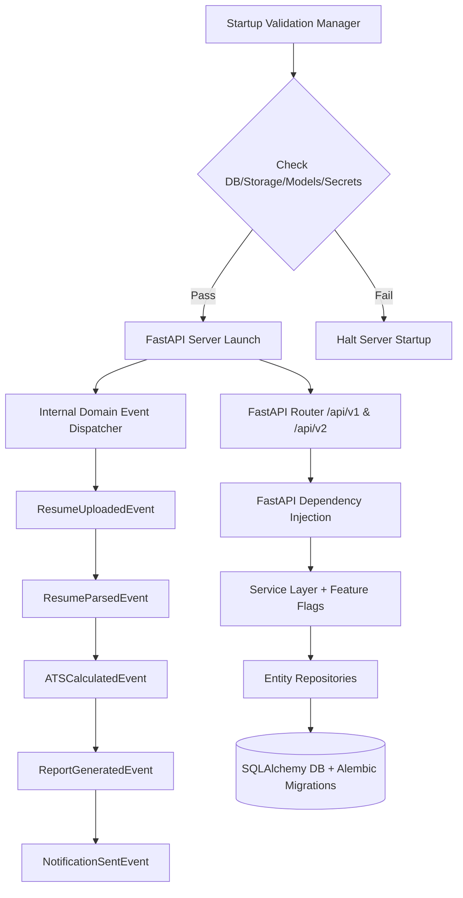
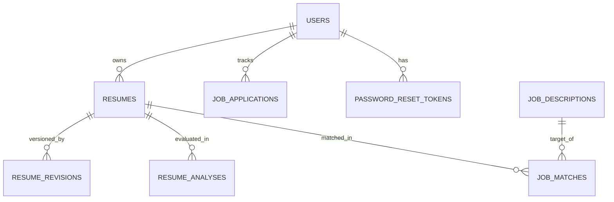

# HireMind AI v3.0 – Enterprise Career Operating System

[](https://github.com/shambhushekharsinha-engg/HireMind-AI/actions)
[](https://fastapi.tiangolo.com)
[](https://react.dev)
[](https://www.docker.com/)
[](https://opensource.org/licenses/MIT)

> **HireMind AI** is an enterprise-grade **Career Intelligence Operating System** built with clean software engineering principles. It features repository-layer database isolation, a deterministic feature-engineered resume quality pipeline, a FAISS vector store with RAG context retrieval, a lightweight internal domain event dispatcher, structured security and audit logging, Prometheus telemetry, fail-fast startup checks, and complete containerization.

---

## 👨‍💻 Developer Profile & Lead Architect Showcase

> Engineered by a Lead AI Systems Architect focusing on scalable API design, deterministic machine learning pipelines, vector search RAG systems, and production-grade software engineering.

### 👤 Lead Engineer Philosophy
- **Role**: Lead Systems Architect & Senior AI Software Engineer
- **Core Domain**: Enterprise Web Architecture, Deterministic ML Pipelines, Vector RAG Search Engines, Distributed API Systems, System Security, and CI/CD.
- **Architectural Vision**: *"Beyond MVP into Software Engineering — Clean Repositories, Fail-Fast Reliability, Explainable AI, and Zero-Downtime Telemetry."*

### 🚀 Technical Architectural Achievements (v3.0.0 Release Candidate)

#### 1. Repository-Layer Database Isolation
- Decoupled database operations into clean **Repository Classes**:
  - `UserRepository`: User management, credential verification, reset tokens.
  - `ResumeRepository`: Resume documents, revisions, ATS score history, builder drafts.
  - `JobRepository`: Job descriptions, required skills matrix, candidate matching.
  - `ApplicationRepository`: Job application tracking lifecycle.
- **Alembic Database Migrations**: Automated schema version control with SQLite batch mode (`render_as_batch=True`).

#### 2. Deterministic AI Quality Pipeline (Feature Engineering)
- Replaced unexplainable ML models with a **5-Factor Feature Engineering Pipeline**:
  - **Readability**: Flesch Reading Ease analysis.
  - **Action Verbs**: Detection of high-impact executive verbs.
  - **Bullet Density**: Bullet point structure and length optimization.
  - **Quantified Achievements**: Detection of numerical metrics ($/%/x throughput).
  - **Formatting Hygiene**: Clean section header detection and table avoidance.

#### 3. FAISS Vector RAG Engine & Session Memory
- **RAG Pipeline**: `Knowledge Base` $\rightarrow$ `Embedding Cache` $\rightarrow$ `FAISS Vector Store` $\rightarrow$ `RAG Prompt Builder` $\rightarrow$ `LLM` $\rightarrow$ `Answer Validator`.
- **Session Memory**: Turn-by-turn conversation context history retaining previous user interactions for adaptive advice.

#### 4. Internal Domain Event Dispatcher
- In-memory publisher-subscriber event bus decoupling system services:
  - `ResumeUploadedEvent` $\rightarrow$ `ResumeParsedEvent` $\rightarrow$ `ATSCalculatedEvent` $\rightarrow$ `ReportGeneratedEvent` $\rightarrow$ `NotificationSentEvent`.

#### 5. Fail-Fast System Startup Validation
- `StartupValidator` executes prior to accepting traffic:
  - Secret Key presence and length check.
  - Storage directories (`uploads/`, `generated_reports/`) writability.
  - Database connectivity test (`SELECT 1`).
  - spaCy NLP model loading.
  - FAISS Vector Store readiness.

#### 6. Centralized Standardized Error Catalog
- Enforced `HM1000` series standardized error responses:
  - `HM1001`: Resume text parsing failed.
  - `HM1002`: File size exceeds upload limit.
  - `HM1003`: Unsupported extension or MIME type.
  - `HM2001`: Authentication failure.
  - `HM3001`: Centralized AI Evaluation Engine error.
  - `HM429`: Rate limit exceeded.

#### 7. Advanced AI Feature Modules
- **3-Option Selective Bullet Rewriter**: Detects weak bullets and provides `Professional`, `Executive`, and `Metrics-Driven` rewrite choices with Before/After/Reason structures.
- **Timed Multi-Personality Interview Simulator**: Presets (`Strict Tech Lead`, `Supportive HR`, `VP of Engineering`), timer limits (60s/90s), dynamic follow-up questions, and 4D evaluation.
- **Modular Portfolio Analyzer**: `GitHub Analyzer` + `LinkedIn Analyzer` + `Resume Analyzer` + `Project Analyzer` $\rightarrow$ `Overall Candidate Score`.
- **Adaptive Personalized Roadmap Engine**: Dynamically adapts learning steps using current ATS score, target role, missing skills, and learning pace.
- **AI Career Progress Dashboard**: Aggregates ATS trends, skill growth over time, interview performance, and overall career readiness.

#### 8. System Security & Telemetry
- **Security Middleware**: `X-Content-Type-Options: nosniff`, `X-Frame-Options: DENY`, `Referrer-Policy`, `Content-Security-Policy`.
- **Rate Limiter**: Token-bucket sliding-window rate limiter.
- **Distributed Request Lifecycle Tracing**: `X-Trace-ID` and micro-span execution logging.
- **Prometheus Telemetry**: `/metrics` endpoint and Operational Health Dashboard (`/health/dashboard`).
- **Commit-Tagged Load Benchmarks**: Recorded load benchmark history (`benchmark_history.json`).

---

## 🧪 User Validation & Beta Testing Status

> [!NOTE]
> **Beta Testing Phase**: HireMind AI is currently conducting active beta testing with computer science students and job seekers. User feedback collection and parsing accuracy telemetry are in progress. Actual metrics will be published here upon release candidate completion.

---

## 🌐 Live Production Deployments & Observability

- **⚡ Production Web Application (Vercel)**: [https://hiremind-ai-resume.vercel.app](https://hiremind-ai-resume.vercel.app)
- **⚙️ Backend REST API Documentation (Render)**: [https://hiremind-ai-au7b.onrender.com/docs](https://hiremind-ai-au7b.onrender.com/docs)
- **📊 System Health Check**: [https://hiremind-ai-au7b.onrender.com/health](https://hiremind-ai-au7b.onrender.com/health)
- **🖥️ Operational Health Dashboard**: [https://hiremind-ai-au7b.onrender.com/health/dashboard](https://hiremind-ai-au7b.onrender.com/health/dashboard)
- **📈 Prometheus Telemetry**: [https://hiremind-ai-au7b.onrender.com/metrics](https://hiremind-ai-au7b.onrender.com/metrics)

---

## 🏛️ Enterprise System Architecture


```mermaid
graph TD
    Startup[Startup Validation Manager] --> FailFast{Check DB/Storage/Models/Secrets}
    FailFast -- Pass --> Launch[FastAPI Server Launch]
    FailFast -- Fail --> Stop[Halt Server Startup]

    Launch --> EventBus[Internal Domain Event Dispatcher]
    EventBus --> Event1[ResumeUploadedEvent]
    Event1 --> Event2[ResumeParsedEvent]
    Event2 --> Event3[ATSCalculatedEvent]
    Event3 --> Event4[ReportGeneratedEvent]
    Event4 --> Event5[NotificationSentEvent]
    
    Launch --> Router[FastAPI Router /api/v1 & /api/v2]
    Router --> Dep[FastAPI Dependency Injection]
    Dep --> Service[Service Layer + Feature Flags]
    Service --> Repos[Entity Repositories]
    Repos --> DB[(SQLAlchemy DB + Alembic Migrations)]
```

---

## 🗄️ Database Entity-Relationship Diagram (ERD)


```mermaid
erDiagram
    USERS ||--o{ RESUMES : owns
    USERS ||--o{ JOB_APPLICATIONS : tracks
    USERS ||--o{ PASSWORD_RESET_TOKENS : has
    RESUMES ||--o{ RESUME_REVISIONS : versioned_by
    RESUMES ||--o{ RESUME_ANALYSES : evaluated_in
    RESUMES ||--o{ JOB_MATCHES : matched_in
    JOB_DESCRIPTIONS ||--o{ JOB_MATCHES : target_of
```

---

## 📂 Project Directory Structure

```
HireMind-AI/
├── .github/
│   ├── dependabot.yml           # Automated dependency updates
│   └── workflows/
│       └── ci-cd.yml            # GitHub Actions CI/CD pipeline
├── backend/
│   ├── alembic/                 # Database migration scripts
│   ├── app/
│   │   ├── api/                 # API Routes (v1 & v2)
│   │   ├── core/                # Config, Security, Event Dispatcher, Error Catalog, Startup Check
│   │   ├── database/            # SQLAlchemy Engine & Base
│   │   ├── ml/                  # Feature engineering & NLP models
│   │   ├── models/              # SQLAlchemy Database Models
│   │   ├── repositories/        # Repository Pattern Data Access Layer
│   │   ├── schemas/             # Pydantic Request/Response Schemas
│   │   ├── services/            # Evaluation Engine, RAG, Rewriter, Simulator, Progress Dashboard
│   │   └── tests/               # Pytest Test Suite
│   ├── scripts/
│   │   ├── benchmark_load.py    # Performance & Latency Load Benchmarker
│   │   └── benchmark_history.json # Historical Commit-Tagged Benchmark Telemetry
│   ├── Dockerfile               # Backend Docker Container Definition
│   └── requirements.txt         # Dependencies
├── frontend/
│   ├── public/                  # Manifest, favicon, PWA icons
│   ├── src/                     # React App & Components
│   └── Dockerfile               # Frontend Docker Container Definition
├── .pre-commit-config.yaml      # Formatting & Linting Pre-commit Hooks
├── ARCHITECTURE.md              # In-depth System Architecture Document
├── CHANGELOG.md                 # Release Changelog
├── CONTRIBUTING.md              # Open-Source Contribution Guide
├── docker-compose.yml           # Multi-container local orchestration
└── pyproject.toml               # Black, Ruff, and isort Configuration
```

---

## 🔑 Quick Demo Credentials

| Role | Email Login | Mobile No. Login | Password | Access Level |
| :--- | :--- | :--- | :--- | :--- |
| **Student** | `alex.student@hiremind.ai` | `+919876543210` | `demo_pass` | Full Resume, ATS, Job Matcher & Coach |
| **Recruiter** | `recruiter@apextech.com` | `+919876543211` | `demo_pass` | Candidate Ranking & Resume Search |
| **Admin** | `admin@hiremind.ai` | `+919876543212` | `demo_pass` | System Analytics & Metrics Dashboard |

---

## ⚡ Quickstart & Local Installation

```bash
# Clone & Navigate
git clone https://github.com/shambhushekharsinha-engg/HireMind-AI.git
cd HireMind-AI/backend

# Virtual Environment & Install Dependencies
python -m venv venv
source venv/bin/activate  # On Windows: venv\Scripts\activate
pip install -r requirements.txt

# Run Migrations & Start Server
alembic upgrade head
uvicorn app.main:app --reload --port 8000
```

---

## 📄 License & Roadmap

This project is licensed under the [MIT License](LICENSE).
For detailed architecture explanations, refer to [ARCHITECTURE.md](ARCHITECTURE.md) and [CONTRIBUTING.md](CONTRIBUTING.md).
